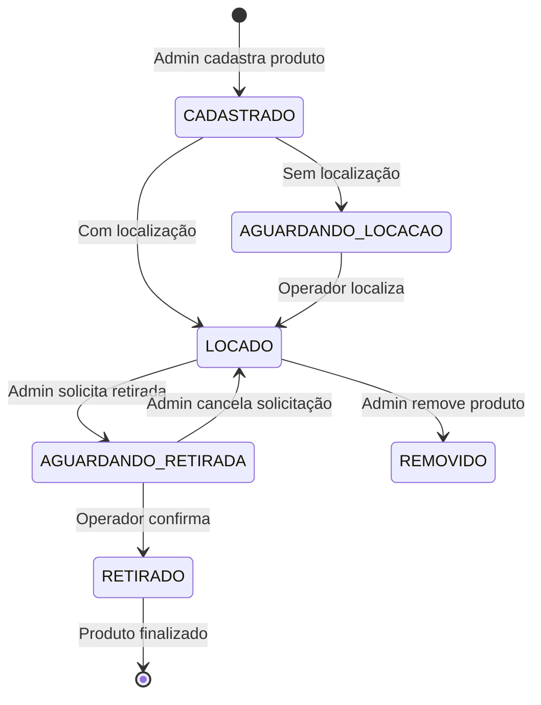

# Especificação Técnica: Sistema de Roles e Workflow de Produtos

## 📋 Visão Geral

Este documento especifica as mudanças arquiteturais necessárias para implementar um sistema de roles diferenciados (Administrador/Operador) e um novo workflow de produtos no Sistema de Gerenciamento de Câmaras Refrigeradas.

## 🎯 Objetivos das Mudanças

### Situação Atual
- Produtos obrigatoriamente precisam de localização no cadastro
- Todos os usuários têm acesso similar às funcionalidades
- Fluxo único de trabalho para todos os tipos de usuário

### Situação Desejada
- **Separação de responsabilidades** entre Administrador e Operador
- **Produtos podem ser cadastrados sem localização** (estado "Aguardando Locação")
- **Novo fluxo de retirada** com solicitação e confirmação
- **Controle de acesso granular** baseado em roles
- **Relatórios específicos** para produtos aguardando locação e retiradas pendentes

## 👥 Definição de Roles

### 🔑 Administrador (ADMIN)
**Responsabilidades:**
- Cadastrar produtos (com ou sem localização)
- Gerenciar usuários e configurações do sistema
- Criar solicitações de retirada (parcial ou total)
- Visualizar todos os relatórios
- Acesso completo ao sistema

**Limitações:**
- Não executa ações físicas (localização, movimentação, confirmação de retirada)

### 👷 Operador (OPERATOR)
**Responsabilidades:**
- Localizar produtos cadastrados sem localização
- Movimentar produtos entre localizações
- Confirmar retiradas solicitadas pelo administrador
- Visualizar histórico de movimentações

**Limitações:**
- Não pode cadastrar novos produtos
- Não pode remover produtos do sistema
- Não pode adicionar estoque
- Acesso limitado apenas às páginas: Produtos (limitado) e Histórico

## 🔄 Estados dos Produtos (FSM - Finite State Machine)

### Estados Definidos
```typescript
enum ProductStatus {
  CADASTRADO = 'CADASTRADO',           // Produto recém-cadastrado
  AGUARDANDO_LOCACAO = 'AGUARDANDO_LOCACAO', // Sem localização definida
  LOCADO = 'LOCADO',                   // Com localização definida
  AGUARDANDO_RETIRADA = 'AGUARDANDO_RETIRADA', // Solicitação de retirada criada
  RETIRADO = 'RETIRADO',               // Retirada confirmada
  REMOVIDO = 'REMOVIDO'                // Produto removido do sistema
}
```

### Transições de Estado Permitidas


## 🏗️ Arquitetura Técnica

### Backend (Node.js + Express + MongoDB)

#### 1. Modelos de Dados (Mongoose)

**Product Model (Atualizado)**
```typescript
interface IProduct extends Document {
  name: string;
  lot: string;
  seedTypeId: ObjectId;
  quantity: number;
  storageType: 'saco' | 'bag';
  weightPerUnit: number;
  totalWeight: number;
  locationId?: string; // OPCIONAL agora
  status: ProductStatus; // NOVO CAMPO
  entryDate: Date;
  expirationDate?: Date;
  notes?: string;
  version: number; // Para optimistic locking
  // ... outros campos existentes
}
```

**User Model (Atualizado)**
```typescript
interface IUser extends Document {
  name: string;
  email: string;
  password: string;
  role: 'ADMIN' | 'OPERATOR'; // NOVO CAMPO
  isActive: boolean;
  // ... outros campos existentes
}
```

**WithdrawalRequest Model (Novo)**
```typescript
interface IWithdrawalRequest extends Document {
  productId: ObjectId;
  requestedBy: ObjectId; // Ref: User (Admin)
  status: 'PENDENTE' | 'CONFIRMADO' | 'CANCELADO';
  type: 'TOTAL' | 'PARCIAL';
  quantityRequested?: number; // Para retirada parcial
  reason?: string;
  requestedAt: Date;
  confirmedAt?: Date;
  confirmedBy?: ObjectId; // Ref: User (Operator)
  notes?: string;
}
```

#### 2. Serviços de Negócio

**ProductService (Expandido)**
```typescript
class ProductService {
  // Criar produto (Admin)
  async create(data: CreateProductData, userId: string): Promise<IProduct> {
    const status = data.locationId ? 'LOCADO' : 'AGUARDANDO_LOCACAO';
    // Implementar lógica de criação com estado inicial
  }

  // Localizar produto (Operator)
  async locate(productId: string, locationId: string, userId: string): Promise<IProduct> {
    // Validar estado AGUARDANDO_LOCACAO
    // Verificar se localização está disponível
    // Transição para LOCADO
  }

  // Mover produto (Operator)
  async move(productId: string, newLocationId: string, userId: string): Promise<IProduct> {
    // Validar estado LOCADO
    // Verificar disponibilidade da nova localização
    // Atualizar localização
  }

  // Remover produto (Admin)
  async remove(productId: string, userId: string): Promise<void> {
    // Transição para REMOVIDO
    // Liberar localização
  }
}
```

**WithdrawalService (Novo)**
```typescript
class WithdrawalService {
  // Solicitar retirada (Admin)
  async requestWithdrawal(data: WithdrawalRequestData): Promise<IWithdrawalRequest> {
    // Validar produto em estado LOCADO
    // Criar solicitação
    // Transição produto para AGUARDANDO_RETIRADA
  }

  // Confirmar retirada (Operator)
  async confirmWithdrawal(requestId: string, userId: string): Promise<IWithdrawalRequest> {
    // Validar estado PENDENTE
    // Confirmar retirada
    // Transição produto para RETIRADO
  }

  // Cancelar solicitação (Admin)
  async cancelWithdrawal(requestId: string, userId: string): Promise<IWithdrawalRequest> {
    // Cancelar solicitação
    // Reverter produto para LOCADO
  }
}
```

#### 3. Middleware de Autorização

**Role-Based Access Control**
```typescript
// Middleware para verificar roles
const authorizeRoles = (...roles: string[]) => {
  return (req: Request, res: Response, next: NextFunction) => {
    if (!req.user || !roles.includes(req.user.role)) {
      return res.status(403).json({ 
        success: false, 
        message: 'Acesso negado para esta operação' 
      });
    }
    next();
  };
};

// Aplicação nas rotas
router.post('/products', authorizeRoles('ADMIN'), productController.create);
router.patch('/products/:id/locate', authorizeRoles('OPERATOR'), productController.locate);
router.post('/withdrawal-requests', authorizeRoles('ADMIN'), withdrawalController.request);
```

#### 4. Endpoints da API

**Produtos**
- `POST /api/products` - Criar produto (Admin)
- `PATCH /api/products/:id/locate` - Localizar produto (Operator)
- `PATCH /api/products/:id/move` - Mover produto (Operator)
- `DELETE /api/products/:id` - Remover produto (Admin)
- `GET /api/products/pending-location` - Produtos aguardando locação

**Solicitações de Retirada**
- `POST /api/withdrawal-requests` - Solicitar retirada (Admin)
- `PATCH /api/withdrawal-requests/:id/confirm` - Confirmar retirada (Operator)
- `PATCH /api/withdrawal-requests/:id/cancel` - Cancelar solicitação (Admin)
- `GET /api/withdrawal-requests/pending` - Solicitações pendentes

### Frontend (React + TypeScript + Material-UI)

#### 1. Contextos e Hooks

**AuthContext (Atualizado)**
```typescript
interface AuthContextType {
  user: User | null;
  isAuthenticated: boolean;
  isAdmin: () => boolean;
  isOperator: () => boolean;
  can: (action: string) => boolean;
  login: (email: string, password: string) => Promise<void>;
  logout: () => void;
}
```

**Novos Hooks Customizados**
```typescript
// Hook para ações de produtos baseadas em role
const useProductActions = () => {
  const { user } = useAuth();
  
  return {
    canCreate: user?.role === 'ADMIN',
    canLocate: user?.role === 'OPERATOR',
    canMove: user?.role === 'OPERATOR',
    canRemove: user?.role === 'ADMIN',
    canRequestWithdrawal: user?.role === 'ADMIN',
    canConfirmWithdrawal: user?.role === 'OPERATOR'
  };
};

// Hook para solicitações de retirada
const useWithdrawalRequests = () => {
  // Lógica para gerenciar solicitações de retirada
};
```

#### 2. Componentes de Interface

**ProductCard (Atualizado)**
```typescript
const ProductCard: React.FC<{ product: Product }> = ({ product }) => {
  const { isAdmin, isOperator } = useAuth();
  const actions = useProductActions();

  return (
    <Card>
      <CardContent>
        {/* Informações do produto */}
        <ProductStatusChip status={product.status} />
        
        {/* Localização ou mensagem de aguardando */}
        {product.locationId ? (
          <LocationDisplay locationId={product.locationId} />
        ) : (
          <Alert severity="warning">Produto aguardando locação</Alert>
        )}
        
        {/* Ações condicionais baseadas em role e estado */}
        <ProductActions product={product} actions={actions} />
      </CardContent>
    </Card>
  );
};
```

**Novos Componentes**
- `ProductLocationForm` - Formulário para localizar produtos (Operator)
- `WithdrawalRequestForm` - Formulário para solicitar retirada (Admin)
- `WithdrawalConfirmationDialog` - Dialog para confirmar retirada (Operator)
- `PendingLocationList` - Lista de produtos aguardando locação
- `PendingWithdrawalList` - Lista de solicitações pendentes

#### 3. Páginas e Navegação

**Navegação Condicional**
```typescript
const Navigation: React.FC = () => {
  const { isAdmin, isOperator } = useAuth();

  return (
    <List>
      <ListItem button component={Link} to="/dashboard">
        <ListItemText primary="Dashboard" />
      </ListItem>
      
      {isAdmin && (
        <>
          <ListItem button component={Link} to="/products/new">
            <ListItemText primary="Cadastrar Produto" />
          </ListItem>
          <ListItem button component={Link} to="/users">
            <ListItemText primary="Usuários" />
          </ListItem>
          <ListItem button component={Link} to="/reports">
            <ListItemText primary="Relatórios" />
          </ListItem>
        </>
      )}
      
      <ListItem button component={Link} to="/products">
        <ListItemText primary="Produtos" />
      </ListItem>
      
      <ListItem button component={Link} to="/history">
        <ListItemText primary="Histórico" />
      </ListItem>
      
      {isOperator && (
        <>
          <ListItem button component={Link} to="/products/pending-location">
            <ListItemText primary="Aguardando Locação" />
          </ListItem>
          <ListItem button component={Link} to="/withdrawal-requests/pending">
            <ListItemText primary="Confirmar Retiradas" />
          </ListItem>
        </>
      )}
    </List>
  );
};
```

## 📊 Novos Relatórios

### 1. Relatório de Produtos Aguardando Locação
- **Acesso**: Admin e Operator
- **Dados**: Lista de produtos com status `AGUARDANDO_LOCACAO`
- **Funcionalidades**: Filtros por data de cadastro, tipo de semente, lote

### 2. Relatório de Solicitações de Retirada Pendentes
- **Acesso**: Admin e Operator
- **Dados**: Lista de solicitações com status `PENDENTE`
- **Funcionalidades**: Filtros por data de solicitação, produto, solicitante

### 3. Dashboard Atualizado
- **Cards de métricas** específicas por role
- **Admin**: Total de produtos cadastrados, aguardando locação, solicitações pendentes
- **Operator**: Produtos para localizar, retiradas para confirmar, movimentações do dia

## 🔄 Fluxos de Trabalho

### Fluxo 1: Cadastro de Produto (Admin)
1. Admin acessa "Cadastrar Produto"
2. Preenche informações obrigatórias
3. **Localização é opcional**
4. Sistema define status:
   - Com localização → `LOCADO`
   - Sem localização → `AGUARDANDO_LOCACAO`
5. Produto aparece na lista com status apropriado

### Fluxo 2: Localização de Produto (Operator)
1. Operator acessa "Produtos Aguardando Locação"
2. Seleciona produto com status `AGUARDANDO_LOCACAO`
3. Escolhe localização disponível
4. Confirma localização
5. Sistema atualiza status para `LOCADO`

### Fluxo 3: Solicitação de Retirada (Admin)
1. Admin acessa produto com status `LOCADO`
2. Clica em "Solicitar Retirada"
3. Escolhe tipo (Total/Parcial) e quantidade
4. Sistema cria solicitação e atualiza status para `AGUARDANDO_RETIRADA`
5. Notificação enviada para operadores

### Fluxo 4: Confirmação de Retirada (Operator)
1. Operator acessa "Confirmar Retiradas"
2. Visualiza solicitações pendentes
3. Seleciona solicitação para confirmar
4. Confirma retirada física
5. Sistema atualiza status para `RETIRADO`

## 🛡️ Segurança e Validações

### Validações de Estado
- Todas as transições de estado são validadas no backend
- Operações só são permitidas em estados válidos
- Logs de auditoria para todas as mudanças de estado

### Controle de Acesso
- JWT tokens incluem informação de role
- Middleware de autorização em todas as rotas protegidas
- Frontend esconde/desabilita ações não permitidas
- Backend sempre valida permissões independentemente do frontend

### Integridade de Dados
- Transações MongoDB para operações críticas
- Optimistic locking para prevenir conflitos
- Validação de localização única (One Location = One Product)

## 📈 Migração de Dados

### Script de Migração
```typescript
// Migração para produtos existentes
const migrateExistingProducts = async () => {
  const products = await Product.find({});
  
  for (const product of products) {
    if (product.locationId) {
      product.status = 'LOCADO';
    } else {
      product.status = 'AGUARDANDO_LOCACAO';
    }
    product.version = 0;
    await product.save();
  }
};

// Migração para usuários existentes
const migrateExistingUsers = async () => {
  const users = await User.find({});
  
  for (const user of users) {
    // Definir role baseado em critério específico
    user.role = user.email.includes('admin') ? 'ADMIN' : 'OPERATOR';
    await user.save();
  }
};
```

## 🧪 Estratégia de Testes

### Testes Backend
- **Testes unitários** para services e validações de estado
- **Testes de integração** para endpoints com diferentes roles
- **Testes de transação** para operações críticas

### Testes Frontend
- **Testes de componente** para renderização condicional por role
- **Testes de integração** para fluxos completos
- **Testes de permissão** para verificar controle de acesso

## 📅 Cronograma de Implementação

### Fase 1: Backend Core (2-3 semanas)
- [ ] Atualização dos modelos de dados
- [ ] Implementação dos services
- [ ] Middleware de autorização
- [ ] Endpoints da API
- [ ] Script de migração
- [ ] Testes backend

### Fase 2: Frontend Base (2 semanas)
- [ ] Atualização do AuthContext
- [ ] Hooks customizados
- [ ] Componentes base
- [ ] Navegação condicional
- [ ] Testes frontend básicos

### Fase 3: Interface Completa (2 semanas)
- [ ] Páginas específicas por role
- [ ] Formulários e dialogs
- [ ] Relatórios atualizados
- [ ] Dashboard personalizado
- [ ] Testes de integração

### Fase 4: Refinamentos e Deploy (1 semana)
- [ ] Testes end-to-end
- [ ] Ajustes de UX/UI
- [ ] Documentação final
- [ ] Deploy e monitoramento

## 📝 Considerações Finais

### Benefícios Esperados
- **Separação clara de responsabilidades** entre roles
- **Workflow mais realista** alinhado com operações físicas
- **Maior controle** sobre o processo de armazenamento
- **Rastreabilidade completa** de todas as operações
- **Interface otimizada** para cada tipo de usuário

### Riscos Mitigados
- **Controle de acesso robusto** previne operações não autorizadas
- **Validações de estado** garantem integridade dos dados
- **Transações** previnem inconsistências
- **Testes abrangentes** garantem qualidade

### Próximos Passos
1. Aprovação da especificação técnica
2. Início da implementação seguindo o cronograma
3. Testes contínuos durante o desenvolvimento
4. Treinamento dos usuários finais
5. Deploy gradual com monitoramento

---

*Documento criado em: Janeiro 2025*  
*Versão: 1.0*  
## 📊 Resumo Executivo

**Tempo Estimado**: 7-8 semanas  
**Complexidade**: Média-Alta (6.1/10)  
**Recursos**: 2-3 desenvolvedores full-stack  
**Impacto**: Alto - Mudança fundamental no workflow operacional

### 📈 Benefícios Esperados
- **Eficiência Operacional**: Separação clara de responsabilidades reduz erros e acelera processos
- **Controle de Qualidade**: Fluxo de aprovação para retiradas garante rastreabilidade completa
- **Flexibilidade**: Produtos podem ser cadastrados sem localização imediata
- **Auditoria**: Histórico completo de todas as operações por usuário e role
- **Escalabilidade**: Sistema preparado para crescimento da operação

### 🎯 KPIs de Sucesso
- Redução de 30% no tempo de cadastro de produtos
- 100% de rastreabilidade nas retiradas
- Zero conflitos de localização
- Satisfação do usuário > 90%

### 📋 Plano de Implementação Criado
✅ **16 tarefas técnicas detalhadas** organizadas em 4 fases
✅ **Exemplos de código** para cada componente
✅ **Estratégia de testes** completa
✅ **Análise de riscos** e mitigações
✅ **Cronograma realista** com dependências

## 📊 Resumo Executivo

**Tempo Estimado**: 7-8 semanas  
**Complexidade**: Média-Alta (6.1/10)  
**Recursos**: 2-3 desenvolvedores full-stack  
**Impacto**: Alto - Mudança fundamental no workflow operacional

### 📈 Benefícios Esperados
- **Eficiência Operacional**: Separação clara de responsabilidades reduz erros e acelera processos
- **Controle de Qualidade**: Fluxo de aprovação para retiradas garante rastreabilidade completa
- **Flexibilidade**: Produtos podem ser cadastrados sem localização imediata
- **Auditoria**: Histórico completo de todas as operações por usuário e role
- **Escalabilidade**: Sistema preparado para crescimento da operação

### 🎯 KPIs de Sucesso
- Redução de 30% no tempo de cadastro de produtos
- 100% de rastreabilidade nas retiradas
- Zero conflitos de localização
- Satisfação do usuário > 90%

### 📋 Plano de Implementação Criado
✅ **16 tarefas técnicas detalhadas** organizadas em 4 fases
✅ **Exemplos de código** para cada componente
✅ **Estratégia de testes** completa
✅ **Análise de riscos** e mitigações
✅ **Cronograma realista** com dependências

*Status: Aguardando Aprovação* 